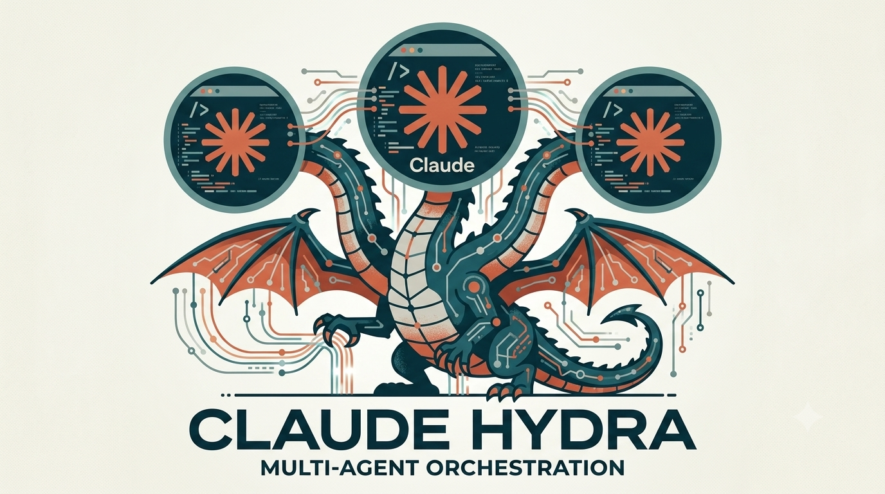

# Claude Hydra



Local dashboard that runs autonomous Claude Code agents against a repo's GitHub issues: a kanban of every open issue, one-click agent sessions in isolated git worktrees, planning agents that propose new tasks toward your goal, and a review-then-push gate so nothing reaches GitHub without you. Standalone Next.js app — runs on your machine, never deployed.

Works with any local git repository that has a GitHub remote. Per-repo runtime state lives inside the managed repo itself, so the orchestrator carries no project data of its own:

- `<repo>/.claude-hydra/` — task state, per-issue logs, goal, planning memory, planning passes (git-ignored)
- `<repo>/.worktrees/` — one worktree per issue (git-ignored)
- `<repo>/.claude/agents/` — the PE/PM planning agents (assigned in Settings → Agents) plus any subagents

> Pointing the orchestrator at a repo is currently done via the `REPO_ROOT` constants in `src/server/*`. UI-based repo management (open/switch multiple repos, IDE-style) is the next step.

## Prerequisites

- `gh` CLI authenticated against the managed repo (`gh auth status`)
- Anthropic auth for the Agent SDK: `ANTHROPIC_API_KEY` exported, or an existing Claude Code login
- Node + pnpm

## Quickstart

```bash
pnpm install
pnpm dev        # dashboard on http://localhost:3002
```

Make sure the managed repo git-ignores `.claude-hydra/` and `.worktrees/`.

## How it works

The orchestrator polls GitHub every 2 minutes (or on "Poll now") to keep the board current with **all open issues**, and mirrors task status through a label loop:

```
(Start button)  →  agent-working  →  agent-committed  →  agent-pr
                        │       ↘                (developer pushes)
                        │        agent-failed
                        ↓
                 agent-needs-input  (session paused on a question)
```

- **Nothing starts automatically** unless you enable auto-pickup. Every open issue appears on the board (filter by its GitHub labels or search by number, title, or assignee); otherwise an agent session begins only when you press **Start agent** on a card.
- A claimed issue gets a git worktree at `.worktrees/issue-{n}` on branch `agent/issue-{n}`, and an agent session starts (fire-and-forget via the Claude Agent SDK).
- A clean finish lands as **committed** (`agent-committed`): the work sits in the worktree until you review it and press **Push & open PR** on the dashboard, which pushes the branch and opens the PR (**`agent-pr`**). If the managed repo's own rules allow the agent to open a PR itself, Hydra detects that and moves the task to `agent-pr` directly. Failures get **`agent-failed`** plus a short comment with the reason (retry from the dashboard).
- If the agent asks a question, the session pauses as **needs_input** — reply from the issue detail page and the session resumes with its full context. The session stays alive while waiting.

There is no cap on concurrent agent sessions — start as many as you want.

**Goal & planning memory** (the Goal page): `.claude-hydra/goal.md` (project goal and current priorities) steers **planning** — the PE/PM planning agents, the ad-hoc planning chat, and proposal discussions. Execution sessions don't receive it: the issue itself is their spec (planning already distilled the goal into it). `.claude-hydra/planning-memory.md` collects durable planning lessons (dismissal reasons, shaping feedback) and is injected into every planning pass. There is no execution memory — implementation sessions get only the issue, the repo's own `CLAUDE.md`/skills, and the optional product map.

**Planning** (the Planning page): runs the assigned PE and PM planning agents (Settings → Agents; a pass refuses to start until both are assigned) in parallel as read-only sessions, synthesizes their reports into a deduped proposal list, and files ONLY what you approve as GitHub issues (label: `proposed`). Previously dismissed/pending/filed proposals are fed back as exclusions so passes don't repeat themselves. Run on demand or on an interval (while the app is running). The model used for planning sessions is configurable (Settings → Planning → Model, `planningModel`), with an automatic fallback when the configured model hits its quota.

**Ad-hoc planning**: the chat drawer on the Planning page lets you shape a direction conversationally, then **Run ad-hoc pass** starts a pass with that transcript injected into the PE/PM and synthesis prompts. Regular (manual or scheduled) passes never see the chat — only ad-hoc passes do.

**Product map** (optional): assign a product-brief agent (Settings → Agents), then **Generate product map** writes `docs/product-map.md` in the managed repo — uncommitted, for you to review and commit. Once the brief agent is assigned, implementation sessions are told to consult (and keep up to date) the product map.

All session prompts — implementation, conflict resolution, the planning wrappers, synthesis, ad-hoc chat, proposal discussion, and the product-map bootstrap — are editable templates (Settings → Prompts), stored per-repo when customized.

## Code layout

The server is layered under `src/server/`, with dependencies flowing downward only:

- `core/` — repo registry, data-dir resolution, GitHub (`gh`) plumbing, worktrees, agent discovery, template rendering
- `state/` — task store and per-issue logs
- `knowledge/` — orchestrator settings (goal, planning memory) and the prompt-template registry
- `planning/` — planning passes, ad-hoc chat, proposal discussion, product-map bootstrap, and their prompt builders
- `execution/` — implementation/conflict sessions, worktree slots, and their prompt builders
- `loop/` — the polling loop and auto-pickup

## Policy lives in the repo, not in Hydra

Hydra manages sessions — worktrees, start/stop/resume, status, logs, the push button. It enforces **no rules of its own** about what agents may do. Each managed repo governs its agents through its own files, which every session loads (`settingSources: ['project']`):

- `CLAUDE.md` — conventions, architecture rules, workflow requirements
- `.claude/settings.json` — `permissions.deny`/`allow` rules, enforced by the Claude Code runtime itself (e.g. deny `Bash(git push:*)` to force the dashboard-push flow)
- `.claude/skills/` — codified procedures; the session prompt lists them and tells agents to prefer them over improvising
- `.claude/agents/` — subagents (reviewers, personas); also listed in the session prompt

A repo with no rules imposes none: its agents can push, open PRs, and fetch freely. Add rules to the repo — not to Hydra — to restrict that. The developer's user-level `~/.claude` settings are never loaded, so sessions behave the same on any machine.

What remains true regardless of repo policy:

- Planning sessions are strictly read-only and cannot create issues themselves (that's what a planning pass *is*).
- The server binds to localhost only, and state-mutating API routes reject non-local origins.
